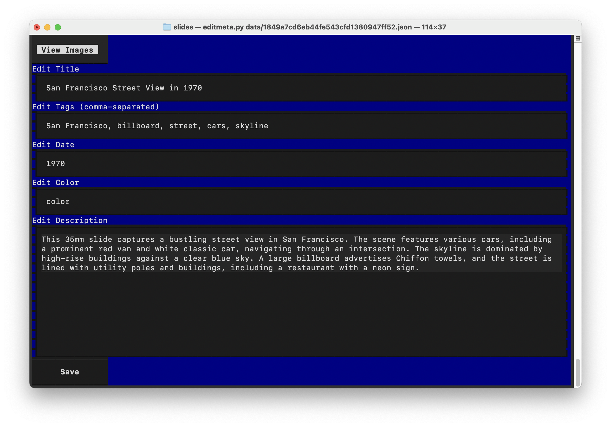

# Slides

Automation for posting 35mm slide images to various places:

* [Internet Archive](https://archive.org/details/@harrisonpage)
* [Bluesky](https://bsky.app/profile/harrison.page)

## Prerequisites

1. Scan image with `QuickScan Plus OF8300i.app` (3600 dpi, color, 48-bit) into `/Users/harrison/Documents/QuickScanPlus_Doc`
2. Open image in Photoshop and adjust as necessary: rotate, Auto Tone, Auto Contrast, Auto Color
3. Save as 1920x JPEG
4. Run `post.sh` against the JPEG
5. Move image to numbered archive folder in `/Users/harrison/scans/` 

## Usage

```bash
./post.sh [Image(s) to upload]
```

One can also run individual scripts, see `post.sh` for usage.

## Features

* Given a set of images, asks local LLM for a description used in metadata and alt-text
* TUI to apply edits

## Notes

* External credentials (Bluesky account info) stored in environment variables

## About

* Created: 29-Jun-2025
* Author: [Harrison Page](https://harrison.page) <harrison.page@harrison.page>

## Screenshot



This is the TUI for editing metadata.

## Example Image


Anonymous photography, San Francisco, 1947
